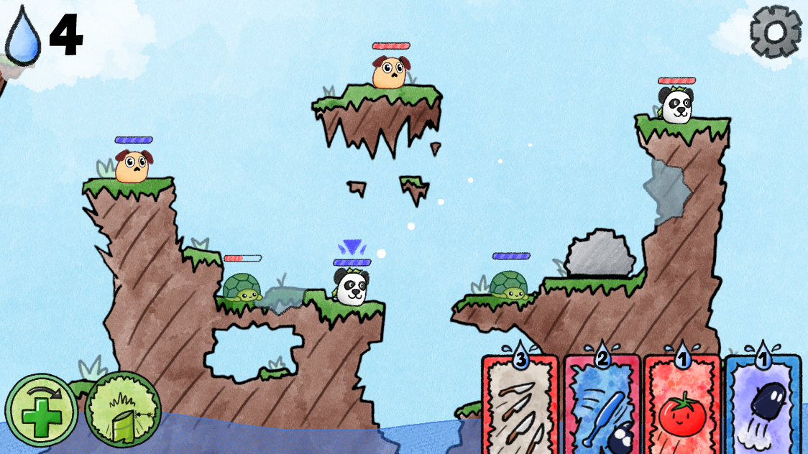
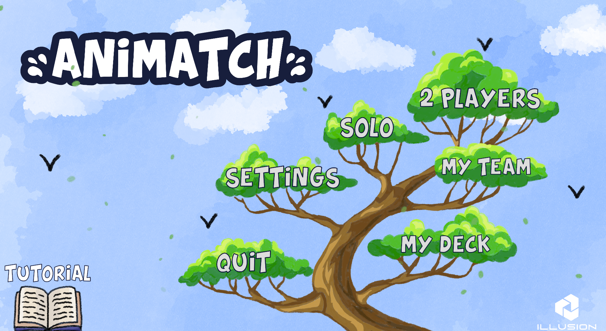

# Animatch

**Animatch** est un jeu de duel stratégique et de création de deck avec destruction de terrain.

## 🎮 Résumé du jeu

Animatch est une fusion entre **Worms** (1995) et **Clash Royale** (2016). C'est un jeu de combat en 1 contre 1 au tour par tour où deux équipes s'affrontent sur un terrain destructible.

### Modes de jeu
* **Solo :** Affrontez un bot capable de réaliser des coups stratégiques et de calculer des trajectoires (Path Finder).
* **Multijoueur local :** Un mode 2 joueurs permettant de s'affronter sur une même instance de jeu.

### Mécaniques de Gameplay
* **Terrain destructible :** Le combat se déroule sur des îles en 2D dont le sol est destructible (missiles, grenades, etc.).
* **Cartes stratégiques :** Chaque action coûte des "drops" (gouttes bleues). Les cartes permettent de tirer, repousser les ennemis au corps-à-corps ou affecter l'environnement.
* **Équipes d'animaux :** Chaque animal possède ses propres points de vie, un effet passif permanent et une capacité spéciale unique nommée "Animax" utilisable une fois.

> **Profondeur stratégique :** Avec un deck de 8 cartes et une équipe de 3 animaux, le jeu propose plus de **800 000 combinaisons** possibles. Chaque partie est unique !

---

## 🎨 Graphismes et Art

La direction artistique vise un public large avec une ambiance "cartoon".

* **Style visuel :** Un mélange entre cartoon et croquis, réalisé avec une résolution **4K** pour un rendu optimal sur tous les écrans.
* **Assets "Fait Maison" :** L'intégralité des 180+ dessins uniques a été conçue sur tablette graphique (XP-PEN) via Clip Studio Paint.
* **Immersion :** Intégration de particules (feuilles, explosions, traînées) et de 6 musiques originales composées sur FL Studio.

---

## 🛠️ Spécifications Techniques

* **Moteur :** Unity.
* **Langage :** C#.
* **Physique :** Gestion des collisions, Rigidbody et destruction via D2Destructible.

---

## 👥 L'équipe ILLUSION

Projet réalisé par 5 étudiants de l'**EPITA** :

* **Adrien Coureau :** Chef de projet, Direction artistique (Graphismes & Son).
* **Josselin Priet :** Responsable Algorithmique et Bot.
* **Guillaume Rat :** Multijoueur, Communication et Launcher.
* **Hector Thubert :** Site Web, Menu et Mode Solo.
* **Guilhem Dardonville :** Physique, Système de cartes et Correction linguistique.

---
